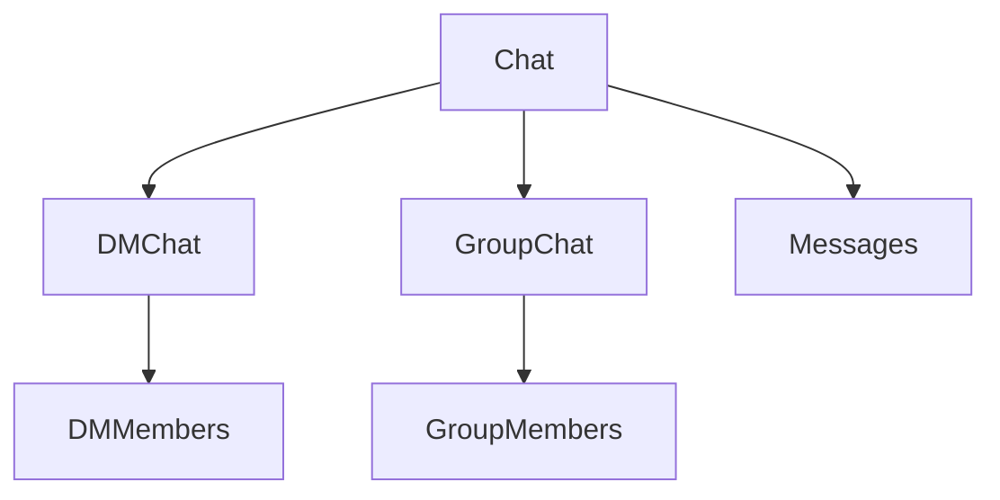

# Chat Domain Separation

## Decision

DMs and Groups are modeled as separate domains
with specialized schemas.

A minimal shared Chat abstraction remains for:

-   unified message ownership
-   socket routing
-   pagination
-   realtime infrastructure

---

# Why

DMs and Groups have fundamentally different:

-   lifecycle semantics
-   metadata
-   permissions
-   moderation requirements
-   membership behavior

Attempting to fully unify both domains creates:

-   optional-field explosion
-   semantic leakage
-   overloaded membership logic

---

# Architecture

---

# Shared Chat Responsibilities

The base Chat abstraction provides:

-   conversation identity
-   message ownership
-   socket room identity
-   pagination identity

It intentionally avoids business-specific logic.

---

# DM Responsibilities

DMs maintain:

-   deterministic uniqueness
-   lightweight membership state
-   block state

---

# Group Responsibilities

Groups maintain:

-   roles
-   moderation lifecycle
-   invites
-   ownership
-   historical membership state

---

# Tradeoffs

## Pros

-   cleaner domain boundaries
-   reduced schema ambiguity
-   easier future scaling
-   isolated domain evolution

## Cons

-   additional tables
-   more joins
-   slightly more architectural complexity
