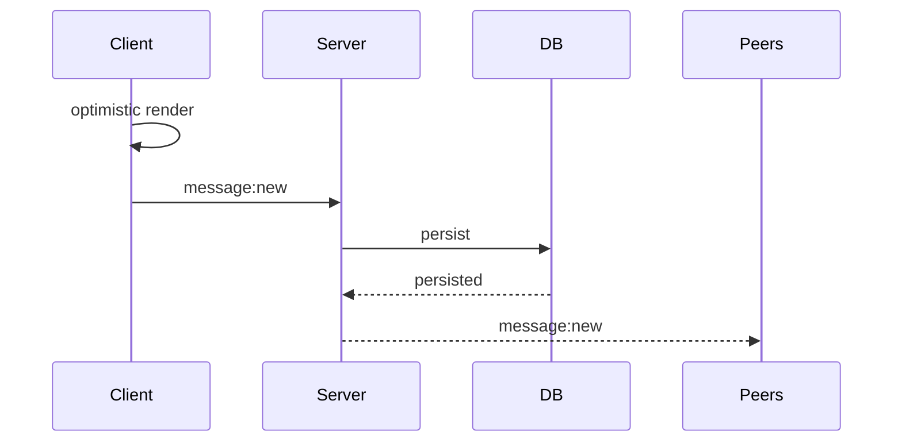

# Optimistic Message Architecture

## Decision

Messages are rendered optimistically on sender clients
before server persistence completes.

## Why

Realtime messaging should feel instant.

Waiting for roundtrip persistence before rendering
creates noticeable latency.

## Flow

## Notes

-   sender does not receive rebroadcast
-   optimistic message uses final message ID
-   optimistic state transitions:
    -   sending
    -   sent
    -   failed

## Tradeoffs

### Pros

-   instant UX
-   reduced perceived latency
-   smoother messaging experience

### Cons

-   optimistic reconciliation complexity
-   failure handling complexity
