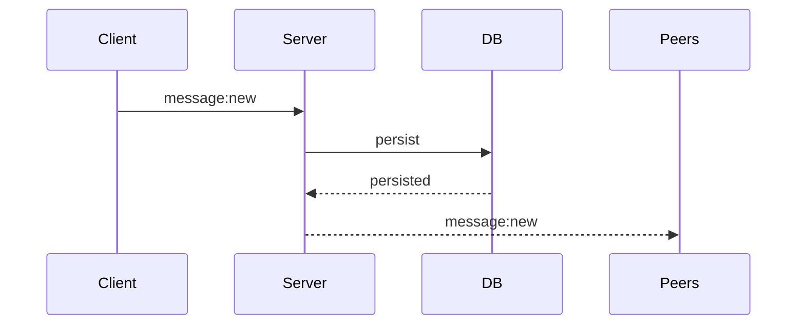

# Persistence Before Broadcast

## Decision

Messages are persisted before realtime broadcast.

## Why

Realtime events must reflect durable state.

Broadcasting before persistence risks:

-   phantom messages
-   synchronization inconsistencies
-   reconnect desynchronization
-   failed persistence after broadcast

## Flow

## Notes

-   database remains source of truth
-   socket events synchronize persisted state
-   reconnect flows rely on persistence correctness

## Tradeoffs

### Pros

-   strong consistency
-   reliable recovery
-   simpler synchronization model

### Cons

-   slightly increased message latency
