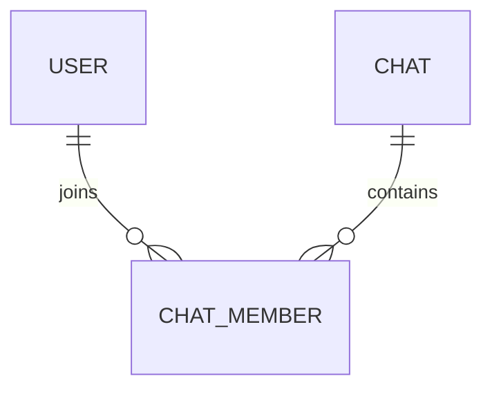

# Chat Schema

## Purpose

Represents a conversation between users.

## Chat Entity

```ts
type ChatType = "dm" | "group";

type Chat = {
    id: string;

    type: ChatType;

    createdAt: string;
};
```

## Chat Member Entity

```ts
type ChatMember = {
    chatId: string;

    userId: string;

    joinedAt: string;
};
```

## Relationships



## Notes

-   chats do not store participantIds directly
-   membership is normalized through chat_members
-   enables future roles/admin systems
-   supports group chats cleanly
