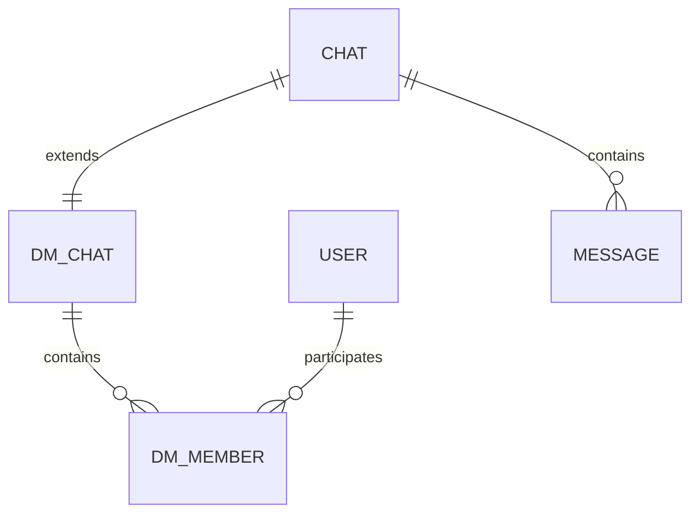

# DM Schema

## Overview

DMs (Direct Messages) represent lightweight
1-to-1 conversation domains.

DMs intentionally maintain simpler semantics than groups.

They do not support:

-   roles
-   invites
-   moderation lifecycle
-   ownership hierarchy

---

# Architecture



---

# Base Chat

```ts
type Chat = {
    id: string;

    type: "dm";

    createdAt: string;
};
```

## Notes

The base Chat entity provides:

-   unified message ownership
-   socket room identity
-   pagination identity
-   realtime synchronization identity

---

# DMChat

```ts
type DMChat = {
    chatId: string;

    /**
     * deterministic sorted participant key
     *
     * example:
     * u1:u2
     */
    dmKey: string;
};
```

## dmKey

`dmKey` exists to prevent duplicate DMs.

The key is generated using:

-   sorted participant IDs
-   deterministic formatting

## Example

```text
u1:u2
```

Both:

-   u1:u2
-   u2:u1

resolve to the same DM key.

---

# DMMember

```ts
type DMMember = {
    chatId: string;

    userId: string;

    blocked: boolean;
};
```

## Notes

DM memberships intentionally remain lightweight.

DMs only track:

-   participation
-   block state

DMs do not require:

-   roles
-   invites
-   bans
-   membership history

---

# Relationships

## Chat -> DMChat

One base Chat maps to exactly one DMChat.

---

## DMChat -> DMMember

One DM contains exactly two participants.

---

## Message Ownership

Messages belong to the base Chat entity.

```ts
type Message = {
    chatId: string;
};
```

This allows:

-   unified pagination
-   unified socket routing
-   shared realtime infrastructure

---

# Design Philosophy

DMs are intentionally isolated from
group-specific complexity.

This prevents:

-   optional-field explosion
-   overloaded membership semantics
-   moderation leakage into DMs

The DM domain remains intentionally minimal.
