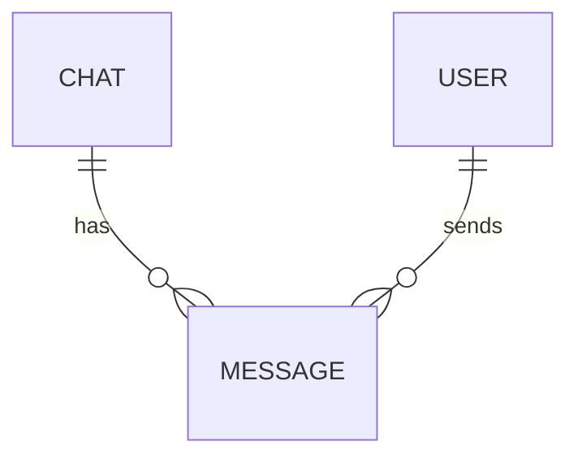

# Message Schema

## Purpose

Represents a chat message optimized for frontend rendering.

## Entity

```ts
type MessageStatus = "sending" | "sent" | "delivered" | "seen";

type MessageReactionSummary = {
    reaction: string;

    count: number;

    /**
     * current authenticated user reacted
     */
    reacted: boolean;
};

type Message = {
    id: string;

    chatId: string;

    senderId: string;

    content: {
        text?: string;

        media?: {
            id: string;

            url: string;

            type: "image" | "video" | "audio" | "file";
        }[];
    };

    reactions: MessageReactionSummary[];

    status: MessageStatus;

    createdAt: string;

    updatedAt?: string;

    editedAt?: string;

    deletedAt?: string;
};
```

## Relationships



## Notes

-   reactions are cached aggregate summaries
-   reactions table exists as source of truth
-   receipts table exists as source of truth
-   messages are immutable except metadata updates
-   messages are paginated newest -> oldest
