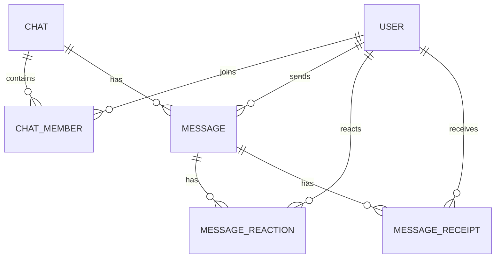

# Schema Overview

## Entity Relationships

## Notes

-   messages contain cached aggregate reaction summaries
-   reactions table is source of truth
-   receipts table is source of truth
-   messages are paginated newest -> oldest
-   frontend receives frontend-optimized payloads
