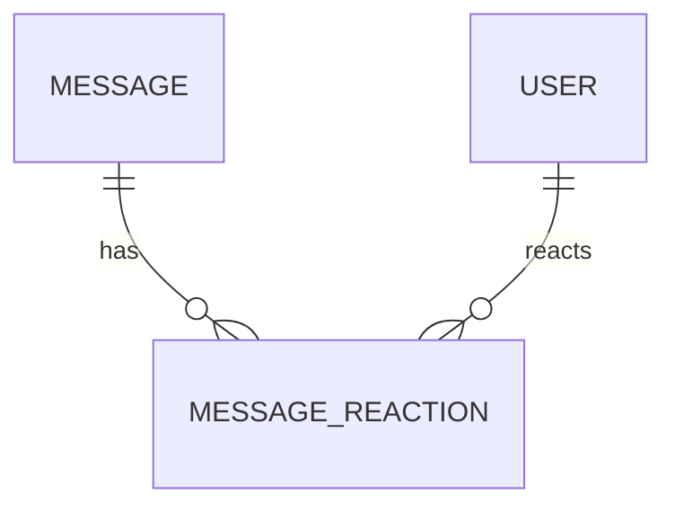
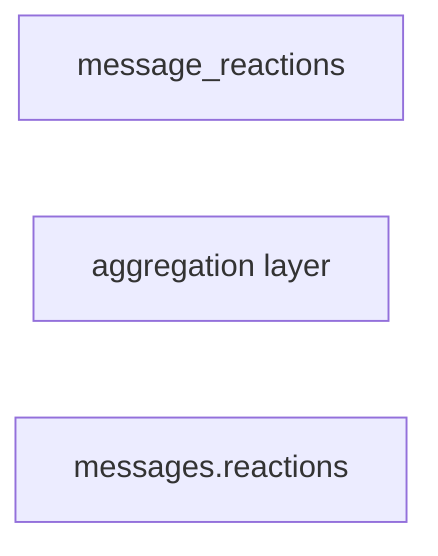

# Message Reactions

## Purpose

Stores normalized reaction data and frontend reaction summaries.

## Source Of Truth Entity

```ts
type MessageReaction = {
    messageId: string;

    userId: string;

    reaction: string;

    createdAt: string;
};
```

## Cached Aggregate Summary

```ts
type MessageReactionSummary = {
    reaction: string;

    count: number;

    /**
     * current authenticated user reacted
     */
    reacted: boolean;
};
```

## Relationships



## Aggregation Flow



## Notes

-   message_reactions is the source of truth
-   messages.reactions stores cached aggregates
-   frontend should not aggregate reactions manually
-   reacted is viewer-specific computed state
