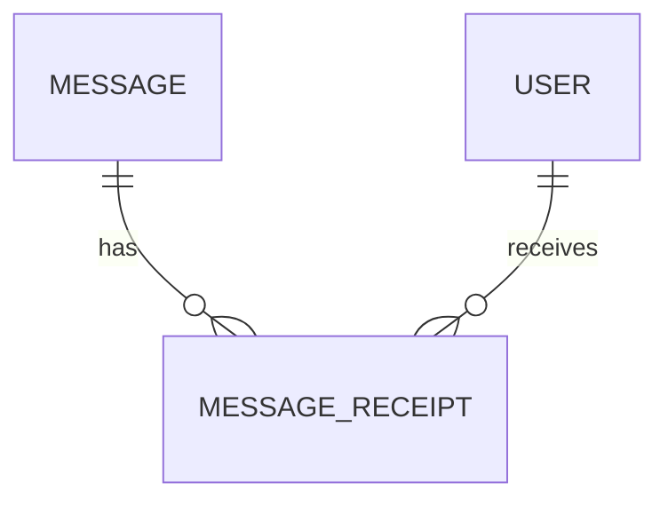
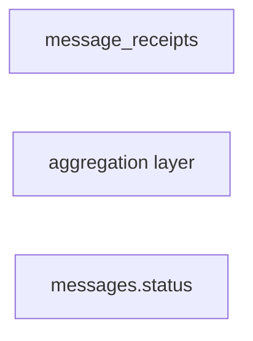

# Message Receipts

## Purpose

Tracks delivery and read state for messages.

## Source Of Truth Entity

```ts
type MessageReceiptStatus = "sent" | "delivered" | "seen";

type MessageReceipt = {
    messageId: string;

    userId: string;

    status: MessageReceiptStatus;

    updatedAt: string;
};
```

## Relationships



## Aggregation Flow



## Notes

-   message_receipts is the source of truth
-   messages.status stores simplified frontend state
-   frontend should not aggregate receipts manually
-   detailed receipt inspection can be loaded lazily
