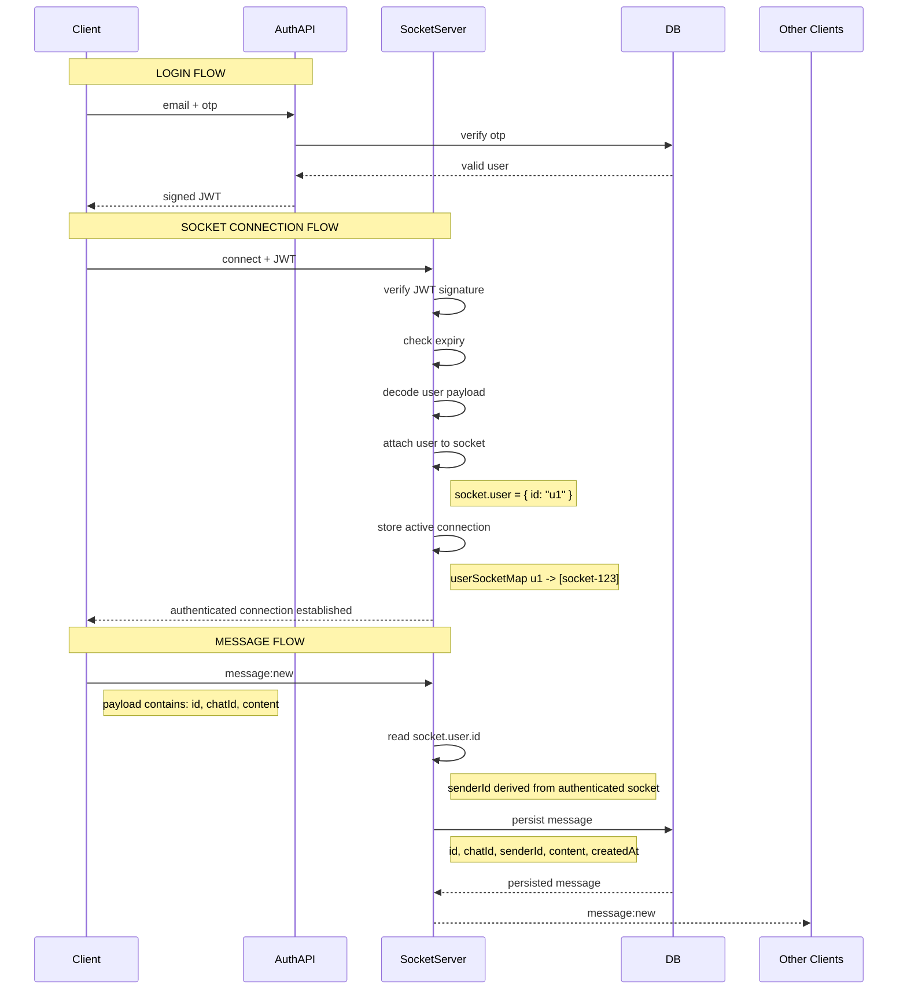

# Socket Authentication

## Overview

Socket connections are authenticated using JWTs.

Authentication happens during socket connection,
before realtime events are processed.

---

# Goals

-   identify authenticated users
-   prevent sender spoofing
-   derive sender identity securely
-   maintain trusted realtime connections

---

# Architecture Overview



---

# JWT Verification

Socket authentication uses JWT verification.

Server verifies:

-   token signature
-   token expiry
-   token validity

## Notes

-   JWT is signed by backend
-   backend owns verification secret
-   client cannot forge valid tokens

---

# Authenticated Socket Context

After verification, server attaches authenticated user
to the internal socket object.

```ts
socket.user = {
    id: "u1",
};
```

## Important

`socket.user` exists ONLY on server.

Client cannot:

-   access it
-   modify it
-   spoof it

---

# Socket Identity vs User Identity

## socket.id

Represents:

-   realtime connection
-   browser tab
-   active device

One user can have multiple socket IDs.

---

## socket.user.id

Represents:

-   authenticated user identity

Used for:

-   senderId derivation
-   authorization
-   permissions

---

# Active Connection Tracking

Server maintains active realtime connections.

Example:

```ts
Map<userId, socketIds[]>;
```

Example:

```ts
{
  "u1": [
    "socket-a",
    "socket-b"
  ]
}
```

## Notes

Used for:

-   multi-device sync
-   presence
-   targeted broadcasting
-   disconnect tracking

Not used as authentication source.

---

# Security Notes

Clients never send:

-   senderId
-   authenticated identity

Sender identity is always derived from:

-   verified JWT
-   authenticated socket context

This prevents:

-   identity spoofing
-   sender impersonation
-   forged events

---

# Future Improvements

-   refresh token flow
-   reconnect authentication
-   token rotation
-   role-based permissions
-   device/session management
