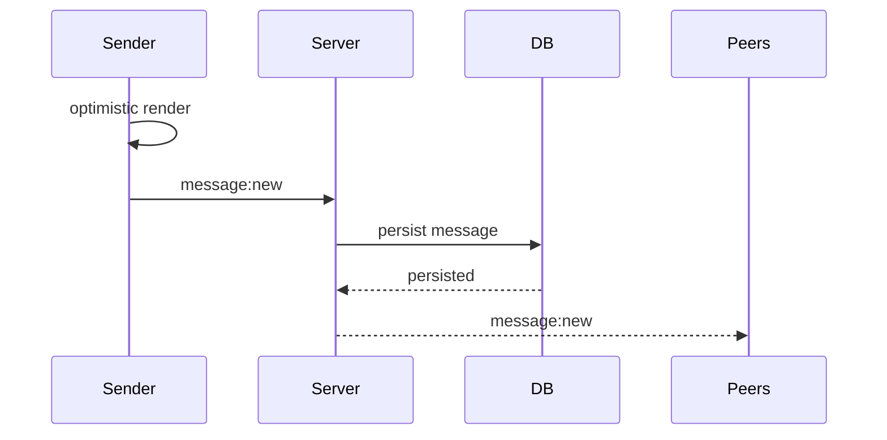

# Message Socket Events

## Overview

Message events are responsible for realtime
message synchronization between chat participants.

Messages are:

-   persisted before broadcasting
-   broadcast only to other peers in the room
-   identified using client-generated ULIDs

---

# Event Naming Strategy

Message events use namespaced event names.

```text
message:new
message:update
message:delete
```

---

# Architecture Notes

-   sender performs optimistic rendering locally
-   sender does not receive rebroadcast
-   server persists before emitting
-   sockets synchronize state
-   persistence remains source of truth

---

# Event Flow



---

# message:new

## Purpose

Creates and broadcasts a new message.

---

## Client -> Server Payload

```ts
type MessageNewInput = {
    id: string;

    chatId: string;

    content: {
        text?: string;
    };
};
```

## Notes

-   id is generated on client using ULID
-   senderId is derived from authenticated socket
-   createdAt is generated by server
-   optimistic rendering happens before emit

---

## Persistence Payload

```ts
type PersistedMessage = {
    id: string;

    chatId: string;

    senderId: string;

    content: {
        text?: string;
    };

    createdAt: string;
};
```

---

## Server -> Peer Payload

```ts
type MessageNewEvent = {
    message: {
        id: string;

        chatId: string;

        senderId: string;

        content: {
            text?: string;
        };

        createdAt: string;
    };
};
```

---

# message:update

## Purpose

Updates an existing message.

## Status

Planned.

---

# message:delete

## Purpose

Deletes an existing message.

## Status

Planned.

---

# Future Improvements

-   media messages
-   message edits
-   message versioning
-   retry/replay support
-   delivery acknowledgements
-   offline synchronization
